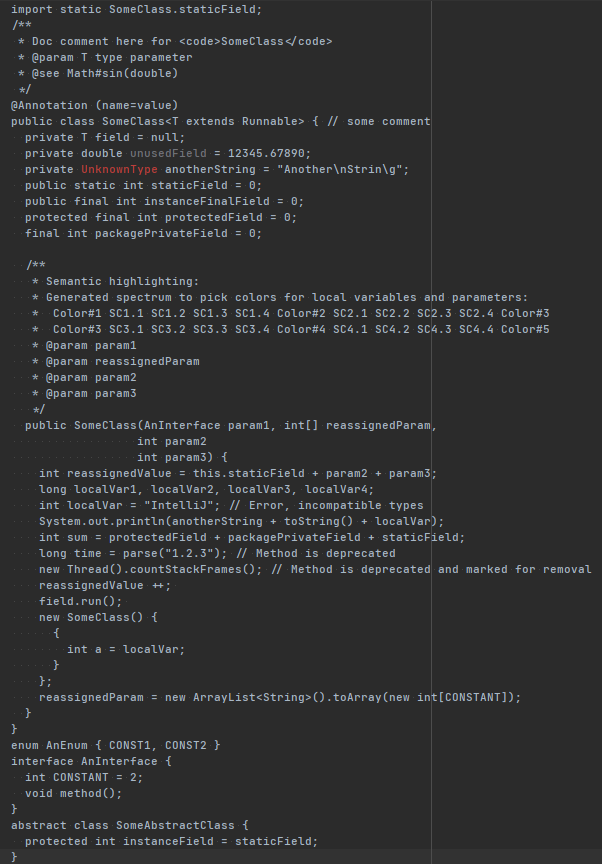
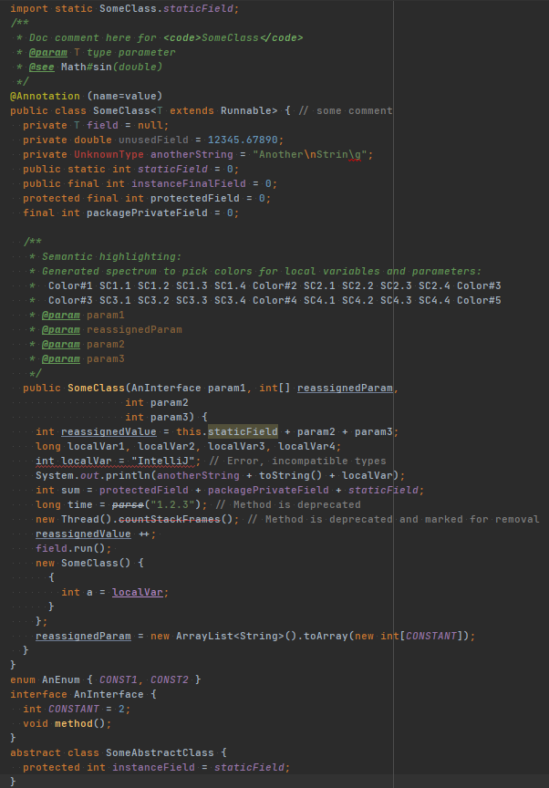
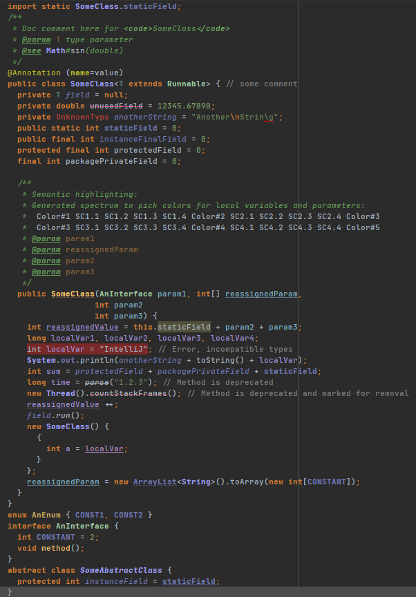
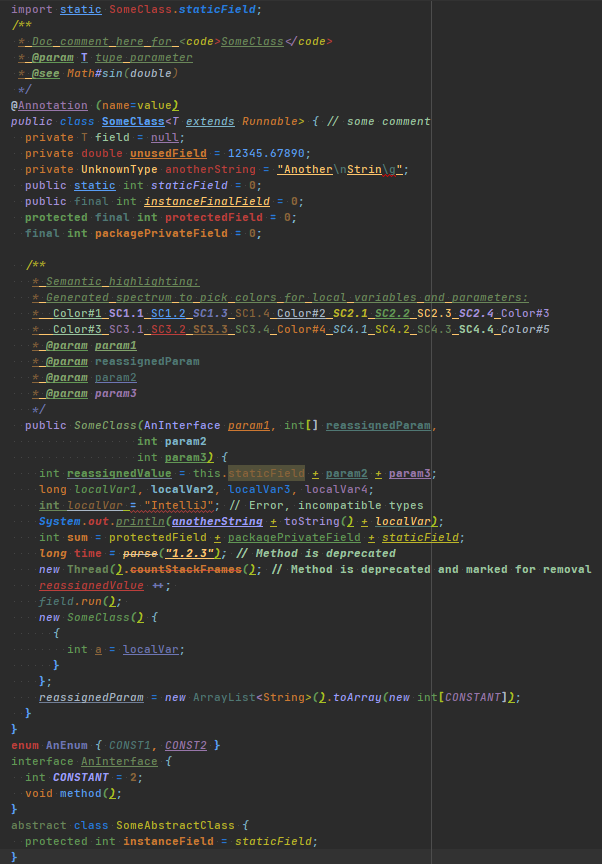

# oth-master-thesis
Additional files for the Master Thesis at the OTH Regensburg "Comparing the impact of code highlighting schemes during code comprehension using eye-tracking technologies"

# Abstract
There is a huge selection of possible ways to highlight code while programming and not enough research on their implications regarding performance and mental load.
This study investigates the effect on mental load for four different highlightings and tries to fill a research gap by including a coloring scheme that doesn't convey any kind of information.
In theory, such a highlighting should display higher mental load, as the processing of color and formatting has to be done, without any kind of performance benefits.
The four chosen color schemes are the Control "light-on-dark", IntelliJ IDEA’s default "Darcula", an extension of "Darcula" with added semantic highlightings and a negative example "Random".
The latter assigns all words a random color to prevent conveying any kind of syntactic or semantic information and tries to intentionally confuse the participants.
Currently there is no research indicating that such a "Random" highlighting scheme degrades readability and comprehension.
A supervised Eye-Tracking study, with additional interviews before and after, was conducted.
13 participants with different experience levels took part.
Candidates were given four Java code comprehension tasks, that consisted of hard code puzzles or exercises, for which they had to find the console output.
While doing so, different metrics, both performance and eye-tracking related, were recorded.
We found some effects that can be reasonably explained, but mainly due to the rather small sample size no statistical significance was found.
It can therefore be concluded that the choice of the syntax highlighting does have some minor effect on mental load while reading code, but it cannot be inferred if they are strictly positive or negative.

| Control "light-on-dark" |  IntelliJ IDEA’s default "Darcula" |
:-------------------------:|:-------------------------:
  |  
| "Darcula" with added semantic highlightings |  "Random" |
  |  

# Index
* `data` contains all the captured data in its raw form. Originating either from the surveys or the eye-tracking session.
* `diagrams` includes all images and data generated by the R scripts. The diagrams are in the `.pdf` file format to allow for scaling without loosing quality inside the master thesis written in LaTeX.
* `docs` has the two survey documents that were used in the study.
* `pics` accommodates overview pictures of the four chosen highlighting schemes.
* `src` holds the source code written by me to wrangle the raw data in R and to add the "Random" highlighting scheme to IntelliJ through the use of a groovy [LivePlugin](https://plugins.jetbrains.com/plugin/7282-liveplugin).

# License
 This work is licensed under a <a rel="license" href="http://creativecommons.org/licenses/by-sa/4.0/">Creative Commons Attribution-ShareAlike 4.0 International License</a>.
